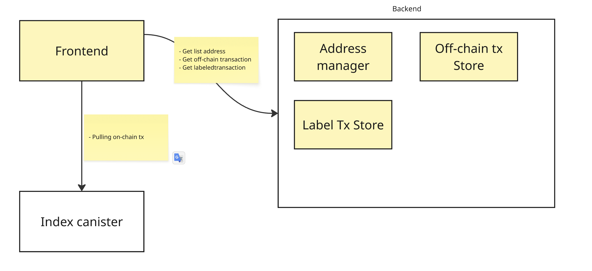

# `dtrack`

## Project Overview

dTrack is a comprehensive financial tracking and analytics platform built on the Internet Computer Protocol (ICP). The application provides real-time monitoring and analysis of both on-chain cryptocurrency transactions and off-chain financial data, offering users a unified dashboard for tracking revenue, cash flow, and business analytics.

### Key Features

- **Multi-Source Data Integration**: Aggregates data from on-chain transactions (ICP ledger), off-chain sources (bank transactions), and frontend metrics
- **Real-Time Analytics**: Provides live revenue tracking, user analytics, and financial insights
- **Canister-Based Architecture**: Built using ICP's canister smart contract system for scalable, decentralized computing
- **Interactive Dashboard**: User-friendly interface for viewing revenue trends, cash flow analysis, and business metrics

### Architecture Overview

The dTrack platform consists of several interconnected components:



**Data Flow:**

1. **On-Chain Transactions**: Direct integration with ICP ledger for cryptocurrency transaction monitoring
2. **Off-Chain Data**: Integration with third-party APIs for bank transactions and external financial data
3. **Frontend Metrics**: Collection of user interaction and application usage data
4. **Data Aggregation**: Central processing service that combines all data sources
5. **Analytics Dashboard**: Real-time visualization of financial trends and business metrics

### Technology Stack

- **Backend**: Rust with IC-CDK (Internet Computer Development Kit)
- **Frontend**: TypeScript/React with Vite build system
- **Blockchain Integration**: Internet Computer Protocol (ICP)
- **Data Sources**: ICP Ledger, third-party financial APIs
- **Authentication**: Internet Identity integration

### Prerequisite

- [Just](https://github.com/casey/just)
- [ic-wams](https://github.com/dfinity/ic-wasm)

### Local deploy

```bash
just build
just dfx_local_deploy


# start the frontend
npm run start
# stop the local deployment
# just dfx_local_stop
# clean the build
# just clean
```
