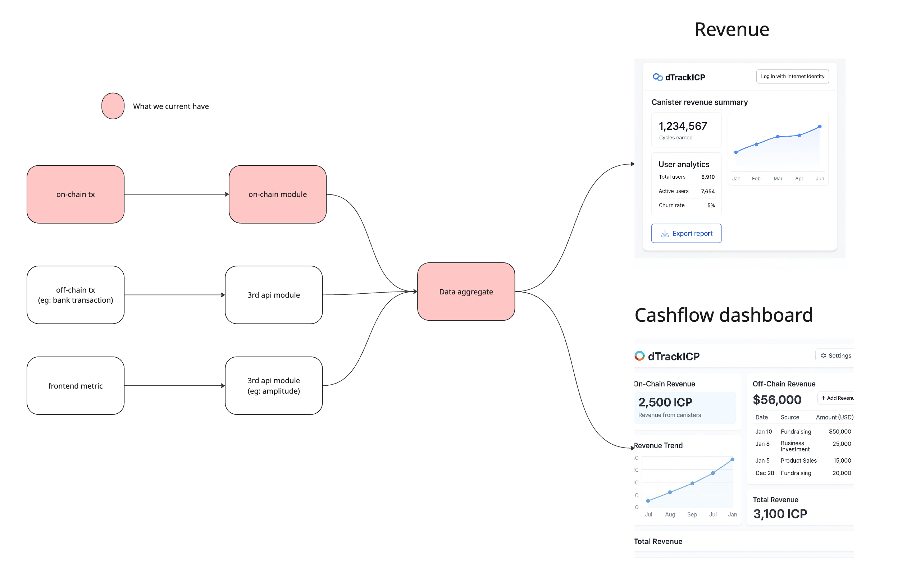
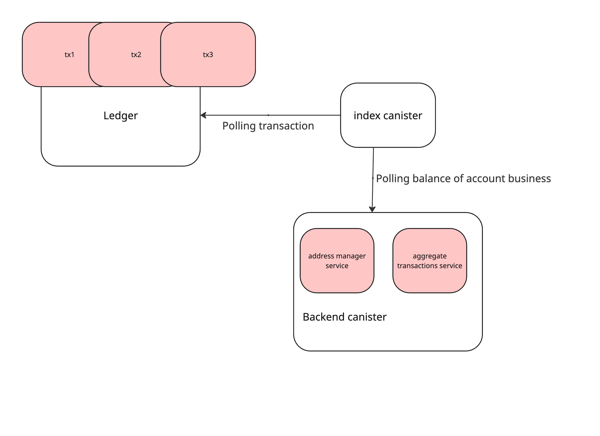

# `dtrack`

## Project Overview

dTrack is a comprehensive financial tracking and analytics platform built on the Internet Computer Protocol (ICP). The application provides real-time monitoring and analysis of both on-chain cryptocurrency transactions and off-chain financial data, offering users a unified dashboard for tracking revenue, cash flow, and business analytics.

### Key Features

- **Multi-Source Data Integration**: Aggregates data from on-chain transactions (ICP ledger), off-chain sources (bank transactions), and frontend metrics
- **Real-Time Analytics**: Provides live revenue tracking, user analytics, and financial insights
- **Canister-Based Architecture**: Built using ICP's canister smart contract system for scalable, decentralized computing
- **Interactive Dashboard**: User-friendly interface for viewing revenue trends, cash flow analysis, and business metrics

### Architecture Overview

The dTrack platform consists of several interconnected components:



**Data Flow:**

1. **On-Chain Transactions**: Direct integration with ICP ledger for cryptocurrency transaction monitoring
2. **Off-Chain Data**: Integration with third-party APIs for bank transactions and external financial data
3. **Frontend Metrics**: Collection of user interaction and application usage data
4. **Data Aggregation**: Central processing service that combines all data sources
5. **Analytics Dashboard**: Real-time visualization of financial trends and business metrics

### Backend Canister Structure



The backend consists of:

- **Index Canister**: Polls transaction data from the ICP ledger and monitors account balances
- **Backend Canister**: Contains two main services:
  - **Address Manager Service**: Manages cryptocurrency addresses and account information
  - **Aggregate Transactions Service**: Processes and consolidates transaction data from multiple sources

### Technology Stack

- **Backend**: Rust with IC-CDK (Internet Computer Development Kit)
- **Frontend**: TypeScript/React with Vite build system
- **Blockchain Integration**: Internet Computer Protocol (ICP)
- **Data Sources**: ICP Ledger, third-party financial APIs
- **Authentication**: Internet Identity integration

Welcome to your new `dtrack` project and to the Internet Computer development community. By default, creating a new project adds this README and some template files to your project directory. You can edit these template files to customize your project and to include your own code to speed up the development cycle.

To get started, you might want to explore the project directory structure and the default configuration file. Working with this project in your development environment will not affect any production deployment or identity tokens.

To learn more before you start working with `dtrack`, see the following documentation available online:

- [Quick Start](https://internetcomputer.org/docs/current/developer-docs/setup/deploy-locally)
- [SDK Developer Tools](https://internetcomputer.org/docs/current/developer-docs/setup/install)
- [Rust Canister Development Guide](https://internetcomputer.org/docs/current/developer-docs/backend/rust/)
- [ic-cdk](https://docs.rs/ic-cdk)
- [ic-cdk-macros](https://docs.rs/ic-cdk-macros)
- [Candid Introduction](https://internetcomputer.org/docs/current/developer-docs/backend/candid/)

If you want to start working on your project right away, you might want to try the following commands:

```bash
cd dtrack/
dfx help
dfx canister --help
```

## Running the project locally

If you want to test your project locally, you can use the following commands:

```bash
# Starts the replica, running in the background
dfx start --background

# Deploys your canisters to the replica and generates your candid interface
dfx deploy
```

Once the job completes, your application will be available at `http://localhost:4943?canisterId={asset_canister_id}`.

If you have made changes to your backend canister, you can generate a new candid interface with

```bash
npm run generate
```

at any time. This is recommended before starting the frontend development server, and will be run automatically any time you run `dfx deploy`.

If you are making frontend changes, you can start a development server with

```bash
npm start
```

Which will start a server at `http://localhost:8080`, proxying API requests to the replica at port 4943.

### Note on frontend environment variables

If you are hosting frontend code somewhere without using DFX, you may need to make one of the following adjustments to ensure your project does not fetch the root key in production:

- set`DFX_NETWORK` to `ic` if you are using Webpack
- use your own preferred method to replace `process.env.DFX_NETWORK` in the autogenerated declarations
  - Setting `canisters -> {asset_canister_id} -> declarations -> env_override to a string` in `dfx.json` will replace `process.env.DFX_NETWORK` with the string in the autogenerated declarations
- Write your own `createActor` constructor
